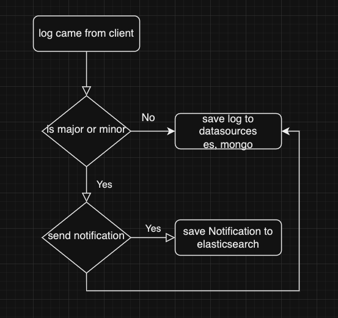

# Real-time Analytics Dashboard with Log Processing

**Project Overview:**
This backend project is designed to process and analyze log data in real-time, providing a user-friendly analytics dashboard for monitoring and visualizing various system metrics. The system uses Elasticsearch for log storage and search, Kafka for real-time data streaming, MongoDB for storing aggregated data, and Redis for caching.

**Key Components:**

**Log Ingestion:**

* Logs from multiple sources (e.g., applications, servers, devices) are collected and ingested into the system.
* Kafka is used as a message broker to handle the high volume of log data and ensure real-time data streaming.


**Log Parsing and Enrichment:**

* Log messages are parsed, enriched with additional metadata (e.g., timestamps, source, severity), and transformed into structured documents.
* Elasticsearch is used as the primary data store for storing and indexing log data.

**Real-time Analysis:**

* Log data is continuously streamed from Kafka to Elasticsearch for real-time analysis.
* Elasticsearch's full-text search capabilities are leveraged to enable users to perform complex queries and searches on log data.

**Data Aggregation and Storage:**

* Aggregated statistics and metrics (e.g., error rates, response times) are calculated and stored in MongoDB to reduce the computational load on Elasticsearch.
* MongoDB serves as a data warehouse for long-term storage of aggregated data.


**Caching for Dashboard:**

* Redis is used to cache frequently accessed data and dashboards to reduce latency and improve dashboard performance.
* Cached data includes real-time metrics and visualizations displayed on the analytics dashboard.


**Analytics Dashboard:**

* A web-based analytics dashboard is provided to users, allowing them to:
* View real-time log data and trends.
* Perform searches and queries on log data.
* Access various visualizations, charts, and graphs.
* Set up custom alerts and notifications based on log events.

**User Authentication and Authorization:**

* User authentication and authorization are implemented to ensure secure access to the dashboard.
* Users can have different levels of access and permissions based on their roles.

**Monitoring and Alerting:**

* The system monitors log data for anomalies and predefined patterns.
* It sends alerts and notifications to relevant users or channels (e.g., email, Slack) when critical events or thresholds are reached.


**Key Technologies:**

- Elasticsearch: For real-time log storage, indexing, and search.
- Kafka: As a message broker for log data streaming.
- MongoDB: For storing aggregated data and providing long-term storage.
- Redis: For caching frequently accessed data, improving dashboard performance.
- Web Framework (e.g., Flask, Django): To build the analytics dashboard.
- User Authentication and Authorization Libraries (e.g., OAuth, JWT): To secure access to the dashboard.
- Monitoring and Alerting Tools (e.g., Prometheus, Grafana): To monitor system health and trigger alerts.
- This project serves as a practical example of how to combine Elasticsearch, Kafka, MongoDB, and Redis to build a real-time analytics dashboard for log processing and analysis. It showcases the power of these technologies in handling large-scale data streams and providing valuable insights for system monitoring and troubleshooting.
```
------------------------------------------
|              Real-time Analytics        |
|               Dashboard                 |
------------------------------------------
| - ElasticsearchClient                   |
| - RedisClient                           |
| - KafkaConsumer                         |
| - MongoDBClient                         |
| - UserAuthenticationManager            |
| - UserAuthorizationManager             |
| - LogDataProcessor                      |
| - VisualizationManager                 |
| - AlertingService                       |
|----------------------------------------|
| + displayDashboard()                   |
| + performSearch(query: string)         |
| + setAlertThreshold(metric: string)    |
| + createAlertRule(rule: AlertRule)     |
| + authenticateUser(username, password) |
| + authorizeUser(user, permission)      |
| + processData(logData: LogData)       |
|----------------------------------------|

------------------------------------------
|                  User                   |
------------------------------------------
| - username: string                      |
| - password: string                      |
| - role: string                          |
|----------------------------------------|
| + login(username, password)             |
| + logout()                              |
| + viewDashboard()                       |
| + searchLogs(query: string)             |
| + createAlertRule(rule: AlertRule)      |
|----------------------------------------|

------------------------------------------
|                Log Data                 |
------------------------------------------
| - timestamp: DateTime                   |
| - source: string                        |
| - message: string                       |
| - severity: string                      |
|----------------------------------------|
| + getTimestamp()                        |
| + getSource()                           |
| + getMessage()                          |
| + getSeverity()                         |
|----------------------------------------|

------------------------------------------
|           Visualization                  |
|           Manager                        |
------------------------------------------
| - chartData: ChartData                  |
| - visualizationType: string             |
|----------------------------------------|
| + renderChart(data: ChartData)          |
| + updateVisualization(type: string)    |
|----------------------------------------|

------------------------------------------
|             Alerting                     |
|             Service                      |
------------------------------------------
| - alerts: Alert[]                       |
| - notificationService: NotificationService |
|----------------------------------------|
| + createAlertRule(rule: AlertRule)      |
| + removeAlertRule(rule: AlertRule)      |
| + sendNotification(alert: Alert)       |
|----------------------------------------|

------------------------------------------
|               Elasticsearch             |
|               Client                    |
------------------------------------------
| - connection: Connection                |
| - index: string                         |
|----------------------------------------|
| + connect(host: string, port: number)   |
| + search(query: string)                 |
| + indexDocument(document: Document)    |
|----------------------------------------|

------------------------------------------
|                 Redis                   |
|               Client                    |
------------------------------------------
| - connection: Connection                |
| - cacheKey: string                     |
|----------------------------------------|
| + connect(host: string, port: number)   |
| + get(key: string)                     |
| + set(key: string, value: string)      |
|----------------------------------------|

------------------------------------------
|                 Kafka                   |
|             Consumer                     |
------------------------------------------
| - topic: string                         |
| - consumerGroup: string                 |
| - brokers: string[]                     |
|----------------------------------------|
| + subscribeToTopic(topic: string)      |
| + consume()                            |
|----------------------------------------|

------------------------------------------
|               MongoDB                   |
|               Client                    |
------------------------------------------
| - connection: Connection                |
| - database: string                     |
| - collection: string                   |
|----------------------------------------|
| + connect(host: string, port: number)   |
| + insertDocument(document: Document)  |
| + updateDocument(filter: Filter, update: Update) |
| + findDocuments(filter: Filter)         |
|----------------------------------------|
```



#### Notes: 
- restart broker if kafka has errors